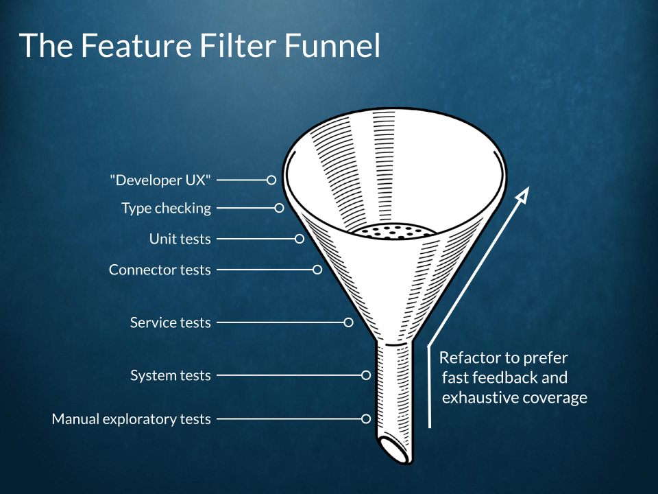

# Kotlin Playbook

How we write (backend) Kotlin code in the Content Acquisition domain of Springer Nature Digital IT.

_A living document_

We follow the [standard Kotlin coding conventions](https://kotlinlang.org/docs/reference/coding-conventions.html), although our codebase predates these, and so may occasionaly diverge for historical reasons.

Beyond the standard coding conventions, we have the following rules of thumb:

Organising the codebase:
* [Classes, Methods, and Extension Functions](classes-methods-extension-functions/README.md)
* [Organising code into files](organising-code/README.md)
* [Tests and supporting code](test-code/README.md)
* [Deployable and library modules](modules/README.md)
* [Deployable modules prefixed by application name](deployable-module-prefixes/README.md)

Design style:
* [Immutable domain models](immutable-domain-models/README.md)
* [Pipelines of transformations](pipelines-of-transformations/README.md)
* [Reporting and handling errors (exceptions, null, monads, etc.)](error-reporting/README.md)
* [Speed bumps](speed-bumps/README.md)
* [Monitoring events, rather than static loggers](monitoring-events/README.md)

Testing:

* [Testing code that parses data from the network](testing-code-that-parses-data-from-the-network/README.md)
* [Testing code that writes data to the network](testing-code-that-writes-data-to-the-network/README.md)
* [Testing multithreaded code](testing-multithreaded-code/README.md)

Things we avoid (in production code):
* [Avoid `lateinit`](lateinit/README.md)
* [Avoid the `!!` operator](bang-bang/README.md)
* [Avoid reflection](reflection/README.md)
