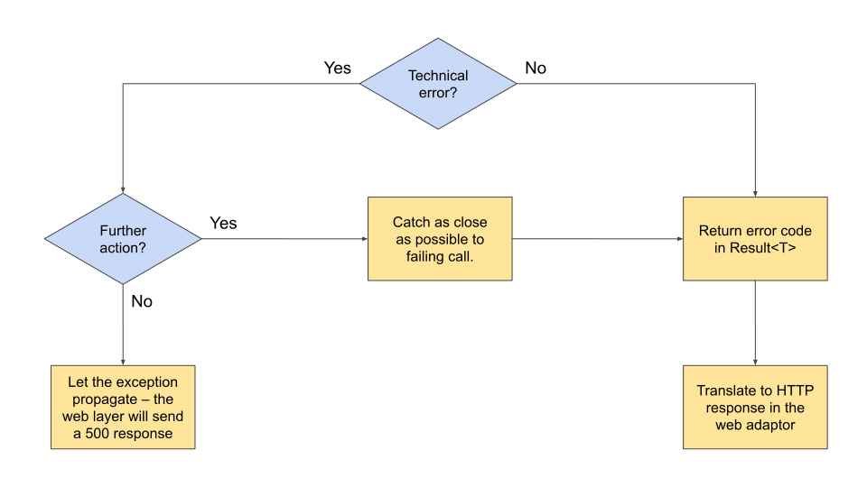

# Reporting and Handling Errors

Exceptions are not type checked, and are slow.

Nullable types do not let us return information about an error.

Therefore...

 * when an error can be handled by a single point in our system (especially if that is in framework code, such as the error handler in the Jetty HTTP server), then we throw an exception.
 * when we need to handle a failure in our code, we use a Result type to return _either_ a successfully computed value, _or_ a failure described by structured data.
 * failures that are explicitly detected by business logic are _always_ returned as a failure case of the Result type.

